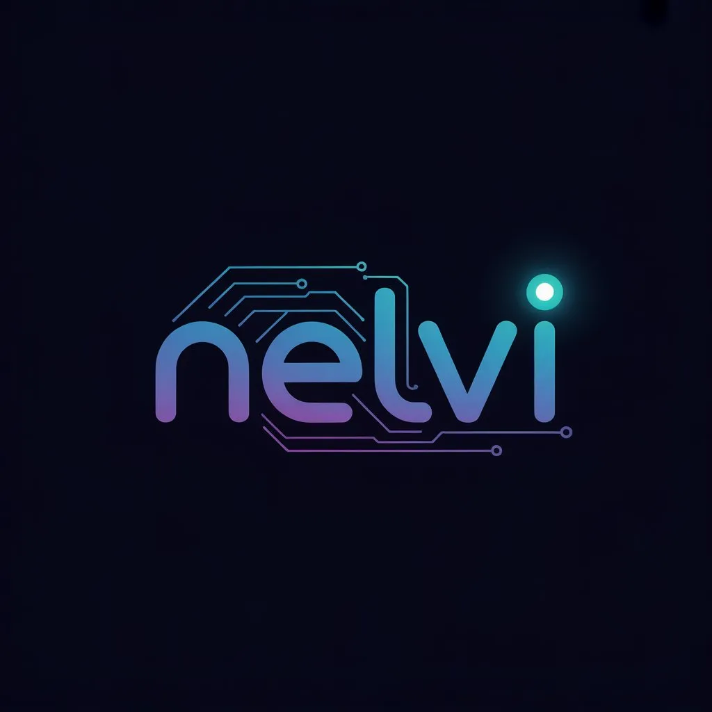

# Transformando ideias em soluções digitais

**Nelvi é uma startup brasileira focada em criar websites personalizados, responsivos e de alta performance para pequenas e médias empresas. Nosso objetivo é transformar ideias em soluções digitais de impacto, ajudando empreendedores e organizações a conquistarem mais visibilidade, credibilidade e crescimento no ambiente online.**

Nosso objetivo é transformar ideias em soluções digitais de impacto, ajudando empreendedores e organizações a conquistarem mais visibilidade, credibilidade e crescimento no ambiente online.  

  

[**Saiba mais >**]()  

---

## Quem somos

Somos uma equipe de jovens desenvolvedores apaixonados por tecnologia, design e inovação.
Na **Nelvi Labs**, unimos expertise técnica e criatividade para oferecer soluções digitais sob medida, que não apenas atendem, mas superam as expectativas dos clientes.

[**Conheça a equipe >**](https://github.com/orgs/nelvi-labs/people)  

---

## O que fazemos

Oferecemos serviços digitais completos para empresas que querem se destacar online:
- **Websites institucionais** — presença profissional e responsiva.
- **E-commerce** — lojas virtuais seguras e escaláveis.
- **Landing pages e blogs** — páginas otimizadas para campanhas e marketing de conteúdo.
- **SEO e otimização** — sites rápidos, ranqueados e com alta performance.
- **Manutenção e suporte** — segurança, atualizações e estabilidade contínua.
- **Integrações** — conexão com redes sociais e sistemas digitais.

Nossa missão é clara:
👉 Tornar o digital mais **acessível, estratégico e transformador** para pequenas e médias empresas.

[**Explore nosso trabalho >**](https://github.com/nelvi-labs)